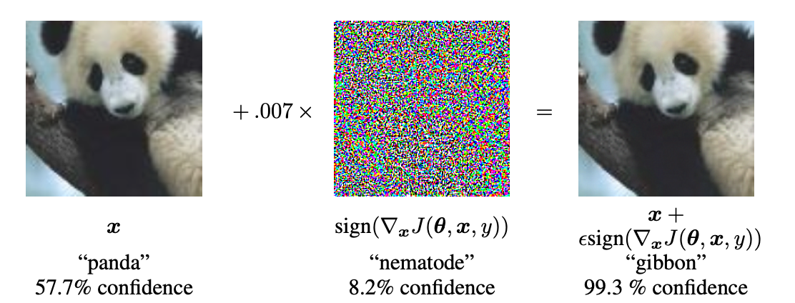
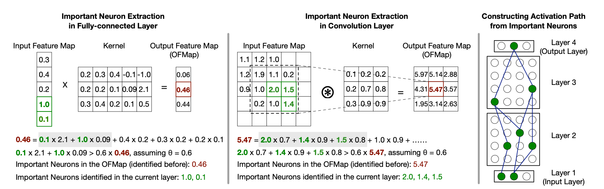
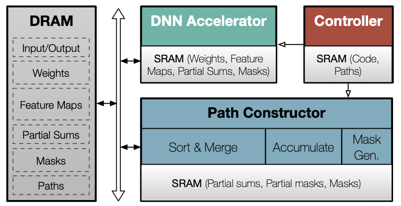
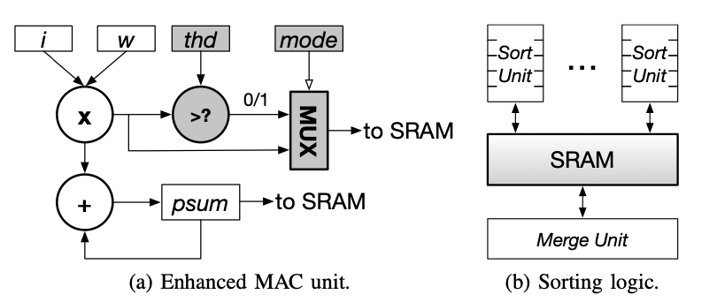

# Evaluating Ptolemy

This repository contains code and execution scripts to evaluate [Ptolemy: Architecture Support for Robust Deep Learning](https://arxiv.org/abs/2008.09954) in terms of energy and area overhead. There are multiple variations to Ptolemy. In this work we study two most efficient variations: `FwAb` and `BwAb`. Also, we assume AlexNet as the target  neural network.

> Disclaimer: I'm not an author of the paper. This is not an official implementation.

---

## Background

### Adversarial attacks
Neural networks pose weakness in that they can be easily fooled with pertubated inputs. For example, adding a very small noise to an image can easily fool image classifiers.



Such possibility opens door to attacks on neural networks. For example, a stop sign on the road may be meddled to cause failure of auto driving systems. Attacks with such motifs are called adversarial attacks.

### Ptolemy

#### Algorithm



Ptolemy is a countermeasure to adversarial attacks. Ptolemy works as follows:
- **(Training)**
    1. To decide important neurons, their values are studied to measure the contribution to the final classification posibility.
        - Specifically, for each column in a partial sum matrix created during matrix-multiplication multiplication, minimal set of neurons such that add up to more than θ rate of contribution to important neurons in the next layer is identified.
        - This process starts from the final class neuron and move backward toward the first layer of the network.
    1. Step 2. **(training)** For each class, one path of important neurons are saved as a large bit mask.
        - All masks identified during training are OR-ed.
- **(Inference)**
    1. For every inference execution, the important path is identified.
    2. If the ratio of overlaping neurons *(between known path and the attained path)* is below a certain threshold ϕ, the input is dimmed as pertubated.

#### BwAb, FwAb

In order to correctly identify important path, all partial sums during inference of a neural network should be saved and sorted. This is likely to incur heavy computation overhead, which is unwanted by customers.

To that end, authors suggest methods to approximate the critical path during inference. The approximation is performed by comparing the neurons against an absolute threshold. If such comparision and accumulation of important path starts from first layer to the last layer, the method is called `FwAb`. `FwAb`'s execution overhead may hide behind the neural network execution. If the threasholding is performed from last layer to the first layer, we refer to it as `BwAb`.


#### Hardware augmentation



In addition to the **DNN accelerator**, few modules should be added to make Ptolemy work. The major additions are **path constructor** and **MUX augmentation** to MAC units witin DNN accelerator. 



Within the DNN accelearator, MAC with 20x20 PE arrays are used. Each MAC unit is augmented with a comparator and a MUX to extract critical path of an inference run. Note that this augmentation is only required for absolute thresholding of `BwAb` and `FwAb`. Also, sorting logic is augmented as a part of the path constructor. This is only required for cumulative method (e.g. `BwCu`). Since we limit our scope to absolute thresholding algorithms, we do not discuss the details of the sorting logic.

---

## Environment

- [CACTI 7.0](https://github.com/insoochung/cacti7-osx-clang): modified for OSX execution.
- icarus-verilog 11.0: For verilog compilation
- yosys 0.12+1: For synthesis

## Quickstart

### Common
```bash
# 1. Pull all required modules
git submodule update --init --recursive 
```
### SRAM area/power estimation
```bash
# 1. Install HP CACTI
cd ${REPO}/sram/cacti
chmod 777 makefile
make all

# 2. Run estimation using script
cd ${REPO}/sram
./eval_sram.sh

# 3. See the estimation results
tail configs/*.out
```

### MAC array area/power estimation
```bash
# 1. Install icarus-verilog and yosys
brew install icarus-verilog yosys

# 2. MAC array with 20x20 PE units
# 2.a Run testbench
cd ${REPO}/logic/code
iverilog mac20x20_test.vl
a.out &> mac20x20_test.log # Examine log for sanity
# 2.b Synthesize 
yosys
# -- Within yosys terminal --
yosys> read_verilog -noblackbox mac20x20.vl
yosys> hierarchy -check -top mac20x20 # Set top module
yosys> proc; opt; fsm; opt; memory; opt # Optimize design
yosys> techmap;  opt  # Link to internal library
yosys> show mac20x20 # Visulaize synthesis results.
yosys> stat # Show gate statistics
# ---------------------------

# 3. *Augmented* MAC array with 20x20 PE units
# 3.a Run testbench
iverilog mac_aug20x20_test.vl
a.out &> mac_aug20x20_test.log # Examine log for sanity
# 3.b Syntehsize
yosys
# -- Within yosys terminal --
yosys> read_verilog -noblackbox mac_aug20x20.vl
yosys> hierarchy -check -top mac_aug20x20 # Set top module
yosys> proc; opt; fsm; opt; memory; opt # Optimize design
yosys> techmap;  opt  # Link to internal library
yosys> show mac_aug20x20 # Visulaize synthesis results.
yosys> stat # Show gate statistics
# ---------------------------

```

## Repository structure
```bash
├── README.md
├── logic # -- Energy/area estimation for Ptolemy logics --
│   └── code
│       ├── adder_32bit.v
│       ├── multiplier_16bit.v
│       ├── mac.vl # a vanilla MAC unit
│       ├── mac_test.vl
│       ├── mac20x20.vl # MAC array with 20x20 PEs
│       ├── mac20x20_test.vl
│       ├── mac_aug.vl # a MAC unit augmented with MUX
│       ├── mac_aug_test.vl
│       ├── mac_aug20x20.vl # augmented MAC array with 20x20 PEs
│       ├── mac_aug20x20_test.vl
│       └── osu035_stdcells.lib
├── sram # -- Energy/area estimation for SRAMs --
│   ├── cacti # CACTI module 
│   ├── configs
│   │   ├── accelerator.cfg
│   │   ├── accelerator.cfg.out
│   │   ├── path_const.cfg
│   │   ├── path_const.cfg.out
│   │   ├── psum_mask.cfg
│   │   └── psum_mask.cfg.out
│   └── eval_sram_power.sh
└── tex
```
